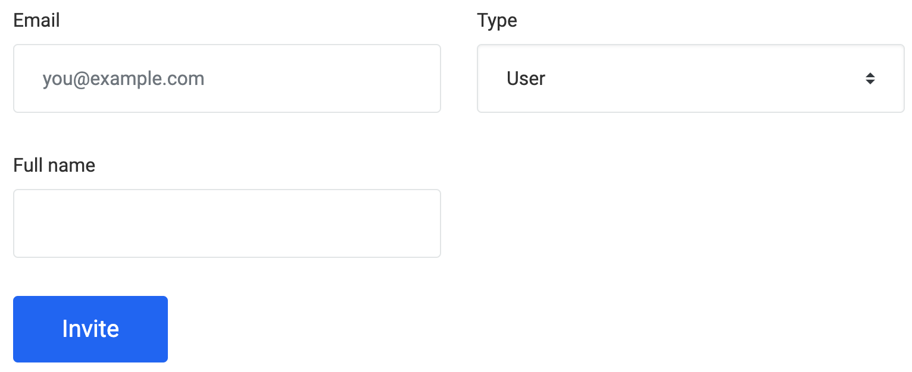

# User Creation Manual

If you have been identified as a `Business Owner` / `Project Manager` of a project using one of the Linkurious technologies,
you can add new members to your project through the [Linkurious Customer Center](https://get.linkurio.us/)
in a few simple clicks:

1. Connect with your account to the project to update (you may have multiple projects associated to your account)
    
    
    
2. Scroll to the section `Contacts` where you can see and maintain your team members
    
    
    
3. Click on the button `+ Add` and fill the form
    
    Use the type `User` if you want to provide the minimum access rights, allowing to access SaaS instances and open support requests
    
    
    
4. After pressing `Invite` your colleague will receive an invitation email to create an account
   on the [Linkurious Customer Center](https://get.linkurio.us/) to be able to enjoy our services

Remember that you can disable users at any time to restrict the access to the project by clicking on the `(edit)` link next to the user.
