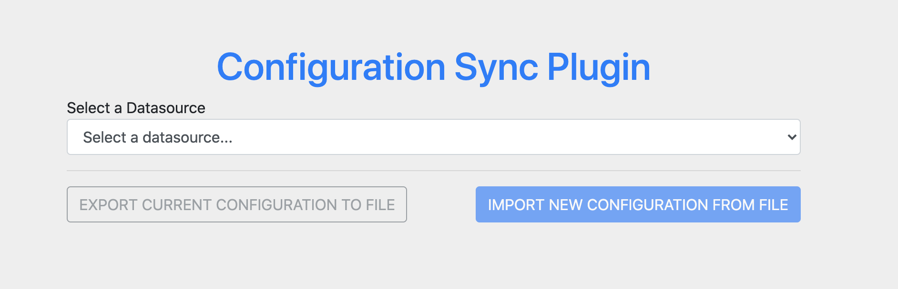
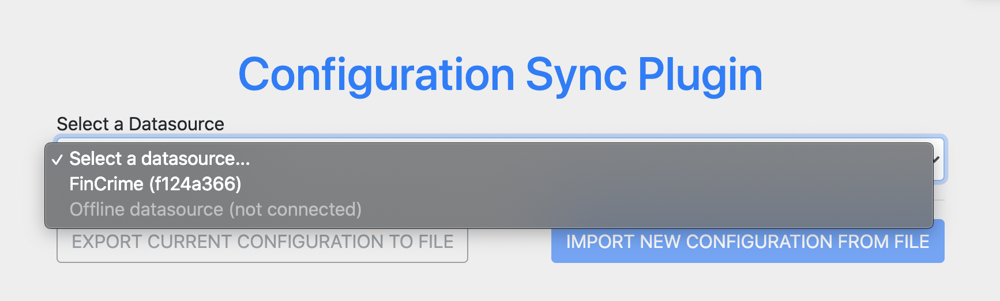
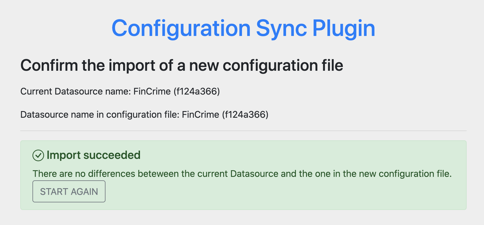
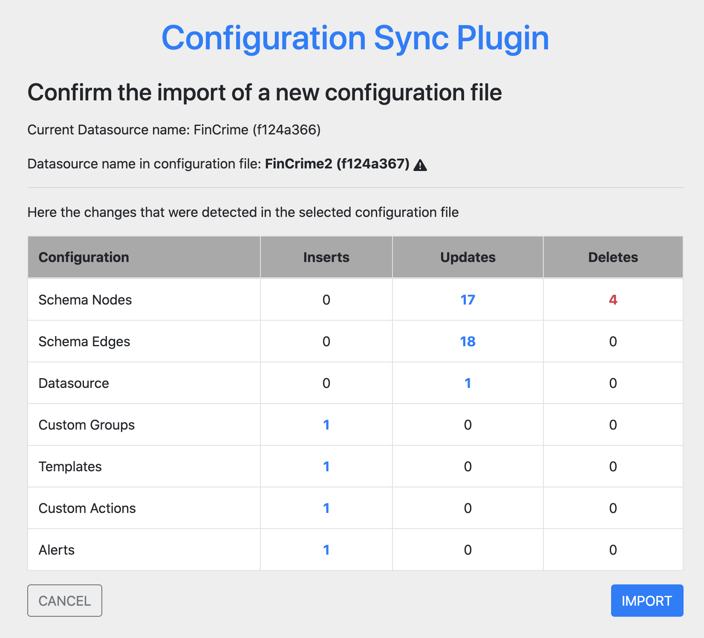
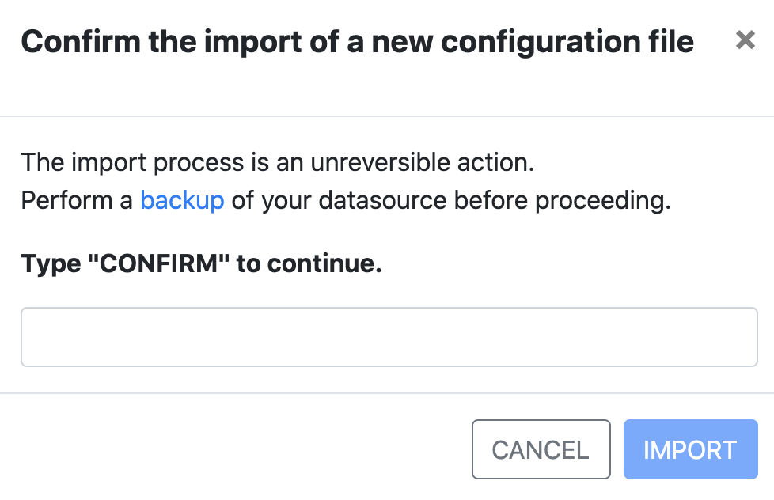

# Configuration Migration Plugin

## Description

The `Configuration Migration` is an official plugin designed to support the deployment of Linkurious Enterprise in a controlled environment having multiple environments (DEV, UAT, PROD etc.) where there is the need to promote configurations from a lower environment to an upper one.

In this context the plugin allows synchronizing (i.e. keep aligned) configurations between environments through the below extra features:
1. Export data from a datasource to a json file (see below what is in scope), usually executed on a lower environment
2. Import configurations to a datasource from a json file (exported by a compatible version of this plugin), usually executed on an upper environment

> The synchronization foreseen deletion activities in the `destination` datasource to keep it aligned with the `source`.

Despite the original need, the export / import functionality could be helpful in other contexts.

Below an example of how the main screen looks like.


> Due possible compatibility issues, the plugin is not supposed to be used to migrate configuration between different versions of Linkurious Enterprise. An error is shown in case the destination system and the exported file don't match on major and minor versioning.

### Versioning

This plugin has strong dependencies with the version of Linkurious Enterprise since the configurations can vary according to new features. The plugin is also relying on Linkurious Enterprise's APIs so its compatibility is affected by the breaking changes introduced in some APIs.

Because of the above dependencies, this plugin is versioned as vX.Y.Z where:
* X will be increased every time there is a change in the core functionality of the plugin
* Y will be increased every time the plugin is updated and tested for a more recent version of Linkurious Enterprise requiring adapting the plugin
* Z will be increased for every patch or not breaking changes of a specific version Y
For more details read the [prerequisites](#prerequisites) section.

Examples:
* v0.1.3 means that this is the 3rd hotfix update of this plugin which can be used on any system which was using the plugin v0.1 (e.g. any version between v0.1.0 and v0.1.2)
* v0.2.0 means that this release introduces the changes that most likely will require you to update to the latest Linkurious Enterprise version for being used properly

The plugin manifest contains a minimum requirement for the Linkurious Enterprise version, as a consequense the plugin will fail to start in case there is a mismatch of minor version of Linkurious Enterprise. This doesn't necessarily mean that the plugin is not compatible for this version. You can try to update the manifest and test it out on your own risks.

### Prerequisites

- Linkurious Enterprise v4.0.25+
- A connected data-source in Linkurious
- A Linkurious Enterprise [*Service Account*](#service-account-recommendations) to be the owner of the new objects in the destination datasource


## Configuring the Plugin

Here an example of the configuration in the `Plugin settings` section of Linkurious Enterprise.
```json
{
  "config-migration": [
    {
      "basePath:": "config-migration",
      "saUsernameOrEmail": "username",
      "saPassword": "********",
      "disableServices": ["queries", "templates", "custom_actions", "alerts"]
    }
  ]
}
```

* `saUsernameOrEmail` (optional): the `username` or `email` of an existing *Service Account* that will be used to perform any export and import activities. This parameter can be omitted when using only the 
* `saPassword` (optional): if not specified, the plugin will allow operations only when directly connected as the user specified in `saUsernameOrEmail`; if specified, it has to contain the password of the `saUsernameOrEmail` account for impersonation during export / import activities.
* `enableServices` (optional): a list of services to activated for the import procedure (see [Data Migration scope](#data-migration-scope) for the list of accepted values); this is not usable in conjuction with `disableServices`.
* `disableServices` (optional): a list of services to be disabled from the import procedure (see [Data Migration scope](#data-migration-scope) for the list of accepted values); this is not usable in conjuction with `enableServices`.
  
> For ensuring file compatibility, chosing to activate only a subset of services will not impact the export procedure that is providing the same output regardless of this configuration.

Simplest configuration to only migrate the schema:
```json
{
  "config-migration": [
    {
      "basePath": "schema-migration",
      "enableServices": [
        "schema_nodes",
        "schema_edges"
      ]
    }
  ]
}
```

### Service Account Recommendations

The *Service Account* will be used both for *export* and *import* activities.
It could be different among the various instances, however it is suggested to reuse the same username (and possible different password) for an easier management.

The *export* is restricted by security access to the item accessible from the *Service Account*.
Because of this, the recommendation is to associate this account to the `Admin` built-in group and to every custom groups defined in the system.
Consider also to share the configurations (queries, etc.) only with `Custom Groups` and not built-in group.
Using this configuration avoids any problem related to access rights during the export phase.


## How to use the plugin

To access the plugin it is recommended to directly open the home page of the plugin at the following path `https://<your-linkurious-instance>/plugins/config-migration`.

It has to be deployed on both `source` and `destination` Linkurious Enterprise servers.

### Export Feature

1. Access the plugin home page on the `source` Linkurious Enterprise server
1. Select the desired datasource to export from the connected one
   
1. Press the `EXPORT` button and get the json file downloaded on the computer executing the activity

> It is user's responsibility to ensure the security and integrity of the exported file.

#### How to handle errors

There are two main possible cause of failure during the export:
1. Incompatibility: you may receive errors telling that some Linkurious Enterprise API call failed, in that case make sure the plugin you have deployed is compatible with the Linkurious Enterprise version
1. Duplicate detections: even though Linkurious Enterprise allows defining different objects with the same name / title, this is not allowed by the plugin to avoid unexpected behaviors during the import phase; you can fix it by renaming the conflict object or un-sharing it (when possible)


### Import Feature

1. Perform a backup of the `destination` Linkurious Enterprise server
   > Restoring a backup is the only safe procedure to revert changes in case of critical unhandled errors.
1. Put the file to import in a location available from the browser used to run the import (usually is not on the server)
1. Access the plugin home page on the `destination` Linkurious Enterprise server
1. Select the desired datasource where to import the configuration file
   
1. Press the `IMPORT` button

#### No changes detected

If the file to import does not contain changes compared to the current configuration, there are no actions to perform.

The plugin will show a confirmation page similar to the following.


#### Changes detected

If the file to import contains changes compared to the current configuration, the plugin will provide a summary (similar to the following image) of all the changes and asks the user to confirm the action before implementing any change.


The first lines will display details of:
* the datasource selected as the destination of the import
* the datasource in the file used as source of the changes to be imported

> A *warning sign* is shown in case of *datasource name* mismatch, while a *source key* mismatch is considered a common scenario in the context of configuration promotion.

The table after shows the full list of changes that will be imported in the system after the confirmation:
* Each line represent a type of configuration to be aligned; refer to the [Data Migration scope](#data-migration-scope) section for a detailed explanation of each item
* The lines are sorted by their import sequence (i.e. all the changes in the first line will be imported before starting to import the second line etc.)
* The other three columns contain only the count of objects impacted respectively by an `insert`, `updat` or `delate` action
* It is possible to click on each number to get the full list of changes in JSON format for deeper analysis, each object contains information in the `newValue` or `oldValue` (updates actions have both data to allow comparisons)

Once the review has been performed, it is possible to start the real import process by clicking on the `IMPORT` button.
After confirming the extra 


#### How to handle errors

The plugin is fully relying on Linkurious Enterprise APIs for any export and import activities. The plugin is enforcing the right sequence of API call to resolve configuration dependencies and avoid errors due conflicting configurations.

Despite those precautions, it may happen that some API call could fail in case of prerequisites not met or unexpected errors.

In this particular situation the import process is aborted leaving the system in a partial update status. The plugin provides enough details about the failing action and the reason, helping the administrator to understand what are the actions that have been executed and what not. After taking the corrective actions it is possible to retry again the import that is not going to show anymore changes already synchronized.

In case the sequence of actions bring the system in an unrecoverable status, or if the plugin makes changes to internal IDs causing different problems it will be necessary to restore the backup of the user-data store.


## Data Migration scope

The plugin scope is limited to Linkurious Enterprise configurations created within a specific datasource that are supposed to be reusable in the context of a promotion to a different instance.

The above definition is excluding:
* Any global configuration of the system which is not related to a single datasource (e.g. global authentication settings, global web server settings, etc.)
* Any configuration related to the datasource definition (e.g. database connection string, index server configuration, etc.)
* User's migration and any of their private objects (e.g. visualizations, private queries, etc.); the plugin takes into consideration only shared objects

> During the migration activities, the plugin cannot ensure the reuse of same internal IDs when creating new items. So the general assumption is that those IDs will be different and shouldn't be hardcoded any where.
> 
> The plugin is safely managing the mapping of IDs relative to security and sharing options, but is not performing any other data manipulation (e.g. in the contents of the Queries or Custom Actions).

Below the full list of configurations in scope:
* **Schema Nodes** (service: `schema_nodes`): schema definitions for Node Categories and their properties (including visibility and type definition)
  
  > Physical deletions of those objects are not possible, any `delete` activity is implemented as change of visibility to none
* **Schema Edges** (service: `schema_edges`): schema definitions for Edge Types and their properties (including visibility and type definition)
  
  > Physical deletions of those objects are not possible, any `delete` activity is implemented as change of visibility to none
* **Datasource** (service: `datasource`): global datasource settings such as `Strict Schema` enabling, `Property Key Access Right` enabling, `Default Styles`, `Default Captions`, `Default Properties' order`
  
  > All the changes are foreseen as a single `update` activity.
  > 
  > `Default Styles` are represented by a single JSON object, any change to its content is seen as a single change of the whole JSON (there is no fine granularity changes tracking). The same concept applies to `Default Captions`.
* **Custom Groups** (service: `custom_groups`, requires `datasource` and `schema_nodes` and `schema_edges`): custom groups and all their securities definition, built-in groups are excluded since automatically created by the system
  
  > IDs of custom groups will be different from the one in the source system: possible impact on automatic group mapping of groups with external systems (manual configuration out of scope of this plugin)
* **Queries** (service: `queries`, requires `custom_groups` and the configuration of a *Service Account*): not private Static Queries (i.e. shared with everyone or specific groups); the sharing option will synchronized as well
  
  > If an existing Static Query is unshared in the source system, it will not be in the export file anymore. A successive import of will mark this change as a `delete` action and delete the item from the `destination` system.
* **Query Templates** (service: `templates`, requires `custom_groups` and the configuration of a *Service Account*): not private Query Templates (i.e. shared with everyone or specific groups); the sharing option will synchronized as well
  
  > If an existing Query Template is unshared in the source system, it will not be in the export file anymore. A successive import of will mark this change as a `delete` action and delete the item from the `destination` system.

* **Query Tags** (service: `tags`, requires the configuration of a *Service Account* with *Can create read-only queries and run queries* access rights): all query tags
  > Queries that were assigned tags before the migration, will still have the same tags assigned after the migration.

* **Custom Actions** (service: `custom_actions`, requires `custom_groups` and the configuration of a *Service Account*): not private Custom Actions (i.e. shared with everyone)
  
  > If an existing Custom Action is unshared in the source system, it will not be in the export file anymore. A successive import of will mark this change as a `delete` action and delete the item from the `destination` system.
* **Alerts** (service: `alerts`, requires `custom_groups`): not private Alerts' definition, their models and their folder organization
  
  > Changes to alerts could cause the drop of results and their re-executions.
  > 
  > Changing the alert's title will trigger a sequence of `delete` and `insert` actions implying the lost of worked items. To keep the previous work, it is recommended to manually align the title before the synchronization to trigger only an `update` of the contents.
  > 
  > 
  > Changing the model name of an alert will cause the delition of the old model and the creation of a new one causing a `(deleted)` message on the existing cases. To avoid the inconvenience, it is recommended to manually align the model names before the synchronization to trigger only an `update` of the contents.
* **Spaces** (service: `spaces`, requires `custom_groups`)
  
  > Changing the space's title will trigger a sequence of `delete` and `insert` actions requiring the space being empty. To avoid an error during the synchronization, it is recommended to manually align the title before launching the process.
  > 
  > Removing non empty spaces is not possible, you will still be able to complete the synchronization but you will receive an error at the end with still some spaces to delete.
* **Node Grouping Rules** (service: `node_grouping_rules`, requires `schema_nodes`): definition of node grouping rules of the datasource
  
  > Since it's not possible to edit rules, users should manually delete a rule to recreate a new one with the same name. The plugin will perform the same actions in case differences are detected.
  > 
  > Due the deletion of an existing rule, existing visualizations using the deleted rule will show the nodes ungrouped after the synchronization.

## Audit Trail

To mitigate the risks of using a [*Service Account*](#service-account-recommendations) and to provide additional support material in case of problems during the export / import,
the plugin logs all the actions and their results adding the information of the real user connected to the system.
It is possible to access those logs from the following folder `<linkurious>/data/logs/plugins/config-migration.log` (the file name could be different in case of a plugin configuration different from the one proposed in this document).

To ensure the best traceability of actions, it is recommended to embed the service accounts credentials in the plugin configurations and let the system administrators connect with their own accounts.


## Limitations

* Due security restrictions, an `Application Key` cannot be used to perform all the migration activities requiring to specify an admin account
* Due security restrictions, all the activities has to be performed through a *Service Account*: the export is limited to objet accessible to this account and the import is limited to objects owned by this account
* Due security restrictions the *Service Account* cannot be associated to multiple built-in groups, so it is required to share configurations with custom groups instead of built-in one
* Export and Import activities can be done only on datasources in the `ready` status
* Due the identification of internal objects through incremental numbers, the synchronization of objects between `source` and `destination` is done through their names: this imply that changes to objects' names are tracked as a sequence of `delete` and `insert` actions instead of a single `update`
* Due some internal logic, some updates may not be applied even if the API is not retouring an error (you will receive a dedicated error message telling this). A typical scenario is due configuration mistmatches between source and destination e.g. you have a numeric property indexed on a datasource configured with ElasticSearch but you try to import this configuration on a different datasource configured with Neo4j (which doesn't support index for numeric properties).
* It is not possible to delete spaces that are not empty.


## Available Custom APIs

### Export
Export the current configuration of the server.
* HTTP Verb: `GET`
* API Endpoint: `/api/export/:datasource?download=false`
* URL Parameters:
  * `datasource` (mandatory) \[string\]: the key of an active datasource from which export the configurations
  * `download` (optional) \[bool\]: set to true to trigger file download without extra overhead (useful when called from a browser)
* Returns a JSON object with the `config` attribute containing the configuration

### Compare
Perform the comparison between two configurations.
* HTTP Verb: `POST`
* API Endpoint: `/api/compare/:datasource`
* URL Parameters:
  * `datasource` (mandatory) \[string\]: the key of an active datasource from which export the configurations, use `00000000` in case the old configuration is passed in the body
* Body: a JSON object containing
  * `old` (optional) \[object\]: an exported configuration to be used as reference for the comparison, the current datasource configuration is used when not passed
  * `new` (mandatory) \[object\]: an exported configuration that represents the desired final configuration
* Returns a JSON object with the `diffs` attribute containing an array of JSON objects representing all the changes needed to make the `old` configuration equal to the `new` one

### Import
* HTTP Verb: `PATCH`
* API Endpoint: `/api/import/:datasource`
* URL Parameters:
  * `datasource` (mandatory) \[string\]: the key of an active datasource into which apply changes
* Body: an array of JSON objects representing all the changes to apply (compatible with the results of the [compare](#compare) API)
* Returns a confirmation JSON object
