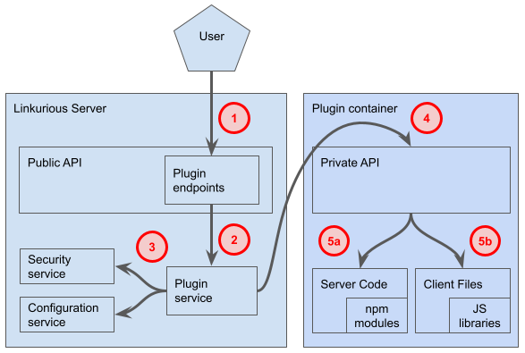
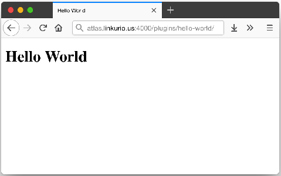
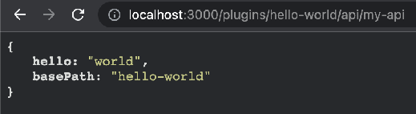
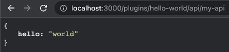
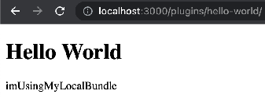
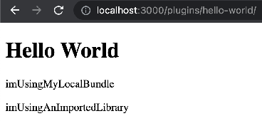
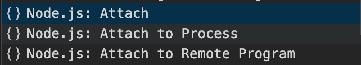
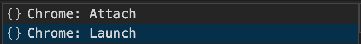

# Plugins Developer Documentation

## For Linkurious Enterprise

- [**What are plugins?**](#what-are-plugins)
  - [Examples](#examples)

- [**How to integrate plugins in Linkurious Enterprise?**](#how-to-integrate-plugins-in-linkurious-enterprise)
  - [Installing a plugin](#installing-a-plugin)
    - [Installing a plugin via docker](#installing-a-plugin-via-docker)
  - [Configuring a plugin](#configuring-a-plugin)
  - [Running several instances of a plugin](#running-several-instances-of-a-plugin)
  - [Checking the status of all plugins](#checking-the-status-of-all-plugins)
  - [Restarting all plugins](#restarting-all-plugins)
  - [Opening a plugin using custom actions](#opening-a-plugin-using-custom-actions)

- [**Plugins architecture**](#plugins-architecture)
  - [General principle](#general-principle)
  - [How a plugin starts](#how-a-plugin-starts)
  - [How a plugin handles queries](#how-a-plugin-handles-queries)

- [**Creating a "Hello World" plugin**](#creating-a-hello-world-plugin)
  - [Creating the plugin development folder](#creating-the-plugin-development-folder)
  - [Creating the manifest](#creating-the-manifest)
  - [Starting the plugin](#starting-the-plugin)
  - [Adding frontend files](#adding-frontend-files)
  - [Adding custom APIs to your plugin](#adding-custom-apis-to-your-plugin)
  - [Adding backend dependencies](#adding-backend-dependencies)
  - [Adding frontend dependencies](#adding-frontend-dependencies)
    - [Option 1: dependency bundling](#option-1-dependency-bundling)
    - [Option 2: remote dependency loading](#option-2-remote-dependency-loading)
  - [Packaging your plugin](#packaging-your-plugin)
  - [Going further](#going-further)

- [**Plugin SDK reference**](#plugin-sdk-reference)
  - [Plugin manifest](#plugin-manifest)
  - [Frontend files](#frontend-files)
    - [Where to put files](#where-to-put-files)
    - [The <base> tag](#the-base-tag)
    - [Single-page applications (SPA)](#single-page-applications-spa)
  - [Backend APIs](#backend-apis)
    - [Router, Request and Response interface](#router-request-and-response-interface)
    - [Interface of "options"](#interface-of-options)
    - [Configuration validation](#configuration-validation)
    - [Configuration and secrets](#configuration-and-secrets)
    - [Audit trail](#audit-trail)
    - [Current user information](#current-user-information)
    - [Writing to the plugin logs](#writing-to-the-plugin-logs)

  - [**Using the Linkurious Enterprise API**](#using-the-linkurious-enterprise-api)
    - [Example](#example)
    - [RestClient reference](#restclient-reference)

- [**Debugging a plugin**](#debugging-a-plugin)
    - [Debugging the Backend Code](#debugging-the-backend-code)
    - [Debugging the Frontend Code](#debugging-the-frontend-code)
    - [Working with a frontend development server](#working-with-a-frontend-development-server)

# What are plugins?

Plugins are ways for developers to add **custom pages** and **custom APIs** to Linkurious Enterprise.

Here are some plugin facts:

- A plugin is a Web application hosted within Linkurious Enterprise  
- Users need to be authenticated with Linkurious Enterprise to access installed plugins  
- Each plugin has its own URL (e.g. https://linkurious.example.com/plugins/my-plugin/)   
- A plugin can add one or more custom Web pages under its URL  
- A plugin can add custom APIs, which are implemented as a Node.js application

## Examples

Here are examples of uses-cases that can be solved by developing a plugin:

1. Display the details of a company using companieshouse.gov.uk  
   1. The plugin would add a new page in Linkurious Enterprise taking as parameter a company name (e.g. https://example.com/plugins/company?name=facebook+uk)   
   2. The plugin would read the "name" parameter from its page, send a search query to beta.companieshouse.gov.uk to resolve the best match for the given company name (e.g. by calling [https://beta.companieshouse.gov.uk/search/companies?q=facebook+uk](https://beta.companieshouse.gov.uk/search/companies?q=facebook+uk)) and select the company code for the first search result.  
   3. The plugin would then read the company details for the resolved company code (e.g. by calling [https://beta.companieshouse.gov.uk/company/06331310](https://beta.companieshouse.gov.uk/company/06331310)) and display the data in a custom manner.  
2. Check if a Customer is on a watchlist using an internal CSV file  
   1. The plugin would add a new page in Linkurious Enterprise taking as parameter a person's social security number (e.g. https://example.com/plugins/watchlist?ssn=123)  
   2. The plugin would call an internal API (e.g. https://example.com/plugins/watchlist/api?ssn=123) to check if the SSN is on a watchlist. The API is part of the plugin and can use whatever method to check the input SSN against a list of SSN is a watchlist file stored internally as a CSV file.  
   3. The plugin would then display the fact that the provided SSN is on a watchlist in its custom page.

# How to integrate plugins in Linkurious Enterprise?

## Installing a plugin

To install a plugin, you need to copy the `.LKE` file in the linkurious/data/plugins/ directory. This needs to be done by a person who has administrator access to the server where Linkurious Enterprise is installed.

Note: the name of a plugin is defined internally (in the [manifest file](#creating-the-manifest)) and does not depend on the name of the `.LKE` file itself.

### Installing a plugin via docker

When running Linkurious Enterprise via the new docker containers, industrialized plugins can be installed simply by setting the following environment variable:

```bash
LKE_PLUGINS='["data-table"]'
```

## Configuring a plugin

Depending on the plugin you are integrating, the plugin might need to be configured before it can be used (e.g. maybe it needs an API Key to be defined).   
The configuration can also be used to customize under which URL the plugin will be made available. By default, a plugin called "my-plugin" is deployed at https://linkurious.example.com/plugins/my-plugin/, but this can be changed.

The plugins configuration is available in the general configuration of Linkurious Enterprise. See [how to edit the general configuration](https://doc.linkurio.us/admin-manual/latest/configure/). The plugins configuration is available under the "plugins".

The section is a JSON object where each property is the configuration for a specific plugin. Only two parameters are defined by default:

* **basePath**: Optional parameter to identify the route of the plugin (defaults to the plugin name)  
* **debugPort**: Optional parameter to identify the debug port of the plugin to connect an external debugger (see [How to debug a plugin](#debugging-a-plugin)). It could be expressed as a number (e.g. 9229) or as a string representing the binding address in case of multiple IPs on the server (e.g. x.x.x.x:9229, or 0.0.0.0:9229 to bind on all)

Some plugins also have plugin-specific configuration fields (these values are passed to the plugin backend at initialization time, see [how to read the plugin configuration](#interface-of-options)).

Here is an example of how to configure a plugin called "data-table":

```json
{
  "data-table": {
    "basePath": "my-custom-path",
    "debugPort": 9229,
    "entityType": "edge",
    "itemType": "HAS_RELATIONSHIP"
  }
}
```

This is how this configuration will be interpreted:

* This configuration will deploy one instance of the plugin called "data-table".  
* "basePath" set to "my-custom-path" will make the instance of the plugin available under the following URL: http://linkurious.example.com/plugins/my-custom-path. Leaving "basePath" unset would have made the plugin available at http://linkurious.example.com/plugins/data-table.   
* "debugPort" set to 9229 enables remote debugging on the port 9229.  
* two custom configuration fields are defined ("entityType" and "itemType") and passed to the plugin.

## Running several instances of a plugin

It is possible to instantiate the same plugin multiple times. Simply use an array of configurations instead of a single configuration object for that plugin.

Here is an example of how to configure several instances of a plugin called "data-table":

```json
{
  "data-table": [
    {
      "basePath": "data-table-node",
      "entityType": "node",
      "itemType": "CATEGORY"
    },
    {
      "basePath": "data-table-rel",
      "entityType": "edge",
      "itemType": "HAS_RELATIONSHIP"
    }
  ]
}
```

## Checking the status of all plugins

It is possible to read the status of all plugins through [Linkurious Enterprise's plugin status API](https://doc.linkurio.us/server-sdk/2.9.0/apidoc/#api-Plugin-getPlugins).   
Just open this URL with your browser: https://linkurious.example.com**/api/admin/plugins** 

This will return a JSON object with the status of all plugins:

```json
[
  {
    "name": "data-table",
    "version": "1.0.0",
    "basePath": "data-table",
    "state": "running"
  }
]
```

"State" can be any of the following:

- "running": the plugin is running normally  
- "stopped": the plugin is stopped  
- "error-runtime": the plugin stopped running because of a runtime error  
- "error-manifest": the plugin did not start because its manifest was invalid

## Restarting all plugins

When saving the configuration of plugins through the Web interface (see [how to configure a plugin](#configuring-a-plugin)), pressing the "save" button actually updates the configuration and restarts all plugins.

If you need to restart plugins for another reason, this can be achieved using the [plugin restart API](https://doc.linkurio.us/server-sdk/2.9.0/apidoc/#api-Plugin-restartAll).  
If you are not sure how to call the plugin restart API, you can [get started with Postman](https://learning.postman.com/docs/postman/sending-api-requests/requests/), a browser extension used to make API requests from your browser.

## Opening a plugin using custom actions

The simplest way to integrate a plugin in Linkurious Enterprise is to create a [custom action](https://doc.linkurio.us/user-manual/2.9.0/custom-actions/) to open the plugin.  
Custom actions are an easy way to open Web pages by right-clicking on a node in Linkurious.

Imagine I have a plugin that computes the age of a person based on their date of birth.  
This plugin is served under https://linkurious.acme.com/plugins/age/ and takes a parameter "date", e.g.: https://linkurious.acme.com/plugins/age/?date=1984-07-31

I would like this plugin to open when I right-click on a person and select the menu "Custom actions" `>`  "Compute age".  
I will [create a new Custom action](https://doc.linkurio.us/user-manual/2.9.0/custom-actions/#creating-and-managing-custom-actions), call it "Compute age" and define its URL template as follows:  
```
{{baseURL}}plugins/age/?date={{(node:Person).dateOfBirth}}
```

This means that:

- the custom action will be available only on nodes of type "Person"
- when clicking on the custom action, a new browser tab will be open at the address defined by the custom actions URL template  
- to build the address, `{{baseURL}}` will be replaced with the address of Linkurious Enterprise, and {{(node:Person).dateOfBirth}} will be replaced by the value of the "dateOfBirth" property on the currently selected node.

Here is an example of a custom action being used: [https://www.loom.com/share/dab052340731480096dac9580cdca4f9](https://www.loom.com/share/dab052340731480096dac9580cdca4f9)

# Plugins architecture

## General principle

Plugins are run in separate processes from the main Linkurious Enterprise process.   


## How a plugin starts

To start a plugin, Linkurious Enterprise reads the [manifest of the plugin](#plugin-manifest) and checks:

- if the plugin is compatible with the current version of Linkurious Enterprise  
- if the folder declared in "publicRoute" exists  
- if the file declared in "backendFiles" exist

It then starts a new process called a "plugin host". The plugin host is connected to the main Linkurious Enterprise instance through a communication channel that allows the main instance to control the plugin (e.g. restart, stop, etc.).

When the plugin host starts, it loads the files declared in the "backendFiles" section of the manifest into a simple [express.js Web server](https://expressjs.com/) and waits for queries.

## How a plugin handles queries

When Linkurious Enterprise receives a query on it's API that is addressed to a plugin, it does the following:

- Checks that the current user is authenticated (if not, redirects to the login page)  
- Checks that the plugin is currently running (if not, respond with a 404 error)  
- Forwards the query to the appropriate plugin (see [Adding custom APIs to your plugin](#adding-custom-apis-to-your-plugin) and  [Backend APIs](#backend-apis))  
- Reads the response from the plugin and forwards it to the original client.

# Creating a "Hello World" plugin

## Creating the plugin development folder

While in development, you can directly create a folder in the `linkurious/data/plugins` folder and start working from there. The folder name must end with `.lke`.   
First, we create a folder called `hello-world.lke` in `linkurious/data/plugins`

## Creating the manifest

Then, in the `hello-world.lke` folder, we create a [manifest file](#plugin-manifest) that defines the name, version and compatible versions of the plugin. The manifest file is called "manifest.json" and has the following content:

```json
{
  "name": "hello-world",
  "version": "1.0.0",
  "pluginApiVersion": "1.0.0"
}
```

We must end up with a file structure like the following:

```text
linkurious
|-- data
|   |-- plugins
|   |   |-- hello-world.lke
|   |       `-- manifest.json
```

## Starting the plugin

Now open the "Global configuration" page in Linkurious Enterprise (e.g. [http://localhost:3000/admin/configuration#plugins](http://localhost:3000/linkurious/admin/configuration#plugins)) and scroll to the "Plugin settings" section. Type a space somewhere in the configuration field (to enable the "save" button) and click "save", this will restart the plugin service and allow Linkurious Enterprise to detect new plugins.

After this, open the [plugin status API](https://doc.linkurio.us/server-sdk/2.9.0/apidoc/#api-Plugin-getPlugins) with your browser (e.g. [http://localhost:3000/api/admin/plugins](http://localhost:3000/api/admin/plugins)) to check the status of your plugin. You should see something like this:

```json
[
  {
    "name": "hello-world",
    "version": "1.0.0",
    "basePath": "hello-world",
    "state": "running"
  }
]
```

## Adding frontend files

Our plugin is now running, but it does not have any frontend files.  
Let's add a simple HTML page to our plugin. 

First, create a "public" (the name can be anything you like) folder within the `hello-world.lke` folder, and create an HTML file called "index.html" (or any other name) in it with the following content:

```html
<!DOCTYPE html>
<html lang="en">
  <head>
    <meta charset="UTF-8" />
    <base href="/">
    <title>Hello World</title>
  </head>
  <body>
    <h1>Hello World</h1>
  </body>
</html>
```

You should end up with a file structure like this:

```text
linkurious
|--data
|  |-- plugins
|  |   |-- hello-world.lke
|  |      |-- public
|  |      |  `-- index.html
|  |      `-- manifest.json
```

Now we need to declare in the plugin manifest where the public files are. Edit the `manifest.json` file in `hello-world.lke` and add a "publicRoute" entry with the value "public" (the name of the folder containing your frontend files):

```json
{
  "name": "empty",
  "version": "1.0.0",
  "publicRoute": "public",
  "pluginApiVersion": "1.0.0"
}
```

Again, open the "Global configuration" page in Linkurious Enterprise (e.g. [http://localhost:3000/admin/configuration#plugins](http://localhost:3000/admin/configuration#plugins)) and scroll to the "Plugin settings" section. Type a space somewhere in the configuration field (to enable the "save" button) and click "save", this will restart the plugin service and restart all plugins, including our "Hello World" plugin.

After this, you can now open the plugin page in the under the "/plugins/hello-world/" path (e.g.   
[http://localhost:3000/plugins/hello-world/](http://localhost:3000/plugins/hello-workd/)). If you named your HTML file "index.html", you can omit the file name ("index.html" is returned by default when no file is specified). Otherwise, you have to specify the file name (e.g. [http://localhost:3000/plugins/hello-world/my-custom-name.html](http://localhost:3000/plugins/hello-world/my-custom-name.html)).  


Well done!

## Adding custom APIs to your plugin

Now let's add a simple backend API to return the [plugin's configuration](#interface-of-options) in JSON format.  
Start by creating a folder called "backend" within the `hello-world.lke` folder, and create a file called `routes.js` in there.

The content of `routes.js` should be:

```javascript
module.exports = function(options) {
  options.router.get("/my-api", function(req, res) {
    res.json(options.configuration);
  });
};
```

Note that we use [`router.get()`](https://expressjs.com/en/api.html#router.METHOD) to declare a new "GET" endpoint on the plugin, and [`res.json()`](https://expressjs.com/en/api.html#res.json) to send a JSON-formatted response.

You should now have the following file structure:

```text
linkurious
|--data
|  |-- plugins
|  |   `-- hello-world.lke
|  |      |-- backend
|  |      |  `-- routes.js
|  |      |-- public
|  |      |  `-- index.html
|  |      `-- manifest.json
```

Now, update the plugin manifest to declare the backend files, by adding a "backendFiles" entry with the value `["backend/routes.js"]`:

```json
{
  "name": "empty",
  "version": "1.0.0",
  "publicRoute": "public",
  "backendFiles": ["backend/routes.js"],
  "pluginApiVersion": "1.0.0"
}
```

Then, open the "Global configuration" page in Linkurious Enterprise (e.g. [https://localhost:3000/admin/configuration#plugins](https://localhost:3000/linkurious/admin/configuration#plugins)) and scroll to the "Plugin settings" section.  
Identify the subsection containing the configuration of the "hello-world" plugin and change it like this:

```json
{
  "hello-world": {
    "hello": "world"
  }
}
```

Now click "save" to restart the plugin service and restart all plugins.

After that, you will be able to access the new API from the `/plugins/hello-world/api/my-api` endpoint (e.g. [http://localhost:3000/plugins/hello-world/api/my-api](http://localhost:3000/plugins/hello-world/api/my-api)).  


Congratulations, it works!

## Adding backend dependencies

To add software dependencies to your project, we recommend using the [npm](https://www.npmjs.com/) package manager.

Position your shell in the `linkurious/data/plugins/hello-world.lke` directory and initialize the npm project:

```bash
npm init
```

Customize the appropriate entries (or keep pressing enter to use the default values).

From the same shell, install the dependency (for the sake of example we use [Lodash](https://www.npmjs.com/package/lodash) to manipulate JavaScript objects):

```bash
npm i --save lodash
```

This command both declares the dependency in the package.json file, and installs it in the "node_modules" folder.

Note: any dependency used by your backend code has to be added to your plugin (i.e. the associate folder in "node_modules" has to be packaged with your plugin, be careful when globally installing packages): consider always installing these modules as production dependencies.

Import and use your dependency in your backend code by editing the "routes.js" file:

```javascript
const myBackendLibrary = require("lodash");

module.exports = function(options) {
  options.router.get("/my-api", function(req, res) {
    res.json(myBackendLibrary.omit(options.configuration, ["basePath"]));
  });
};
```

Restart the plugin and try again to call the previous API. You will now see the filtered configuration object.  


Congratulations, you have imported and used your first backend dependency!

## Adding frontend dependencies

There are two common ways to import third-party libraries in your frontend code: by bundling your libraries into a single file or by importing the script directly in the HTML page.

Let's try again to import the Lodash library but this time to use it in the frontend through both approaches.

### Option 1: dependency bundling

This is the recommended approach to have full control on your dependencies and do not rely on external online services.

Start by creating a file called `index.js` within the `hello-world.lke/public` folder.

The content of `index.js` should be:

```javascript
const myFrontendLibrary = require("lodash");
document.addEventListener("DOMContentLoaded", function(event) {
  const p = document.createElement("p");
  p.textContent = myFrontendLibrary.camelCase(["I'm using my local bundle"]);
  document.getElementsByTagName("body")[0].appendChild(p);
});
```

You should now have the following file structure:

```text
linkurious
|--data
|  |-- plugins
|  |   `-- hello-world.lke
|  |      |-- backend
|  |      |  `-- routes.js
|  |      |-- public
|  |      |  `-- index.html
|  |      |  `-- index.js
|  |      `-- manifest.json
```

Position your shell in the `linkurious/data/plugins/hello-world.lke` directory and install the dependency (not needed if you already have it installed for the backend):

```bash
npm i --save-dev lodash
```

Note: since we will bundle the dependency in our code we will need this module only at development time. Saving the dependency as development will help saving space in the final package.

From the same shell, install a bundling tool (for the sake of example we use [esbuild](https://esbuild.github.io/)):

```bash
npm i --save-dev esbuild
```

From the same shell, bundle your script:

```bash
npx esbuild ./public/index.js --bundle --outfile=./public/index.bundle.js
```

The bundle contains all your frontend code, and its dependencies.

Import the bundle into your `index.html` page:

```html
<!DOCTYPE html>
<html lang="en">
  ...
  <body>
    ...
    <script src="index.bundle.js"></script>
  </body>
</html>
```

Restart the plugin and try again to open again the homepage of your plugin. You will now see a second paragraph with the output generated by the usage of the library bundled in your script.  


Congratulations, you have imported your first frontend dependency!

### Option 2: remote dependency loading

Let's achieve the same result by requiring the library from an external CDN.

**Disclaimer:** even though we recommend the first approach, we report this example for completeness. In case of doubts, please refer to dedicated JavaScript training material to understand pros and cons and make your own decision.

Let's import the library into your "index.html" page:

```html
<!DOCTYPE html>
<html lang="en">
  ...
  <body>
    ...
    <script src="https://cdnjs.cloudflare.com/ajax/libs/lodash.js/4.17.21/lodash.min.js" integrity="sha512-WFN04846sdKMIP5LKNphMaWzU7YpMyCU245etK3g/2ARYbPK9Ub18eG+ljU96qKRCWh+quCY7yefSmlkQw1ANQ==" crossorigin="anonymous" referrerpolicy="no-referrer"></script>
  </body>
</html>
```

**Note:** the script will be downloaded by the browser when accessing the plugin page. If you don't want to rely on external websites, consider embedding the library in your plugin and link a local script.

Add a sample JavaScript code into your "index.html" to use the library:

```html
<!DOCTYPE html>
<html lang="en">
  ...
  <body>
    ...
    <script src="https://cdnjs.cloudflare.com/ajax/libs/lodash.js/4.17.21/lodash.min.js" integrity="sha512-WFN04846sdKMIP5LKNphMaWzU7YpMyCU245etK3g/2ARYbPK9Ub18eG+ljU96qKRCWh+quCY7yefSmlkQw1ANQ==" crossorigin="anonymous" referrerpolicy="no-referrer"></script>
    <script>
      document.addEventListener("DOMContentLoaded", function(event) {
        const p = document.createElement("p");
        p.textContent = _.camelCase(["I'm using an imported library"]);
        document.getElementsByTagName("body")[0].appendChild(p);
      });
    </script>
  </body>
</html>
```

Restart the plugin and refresh the homepage of your plugin. You will now see a new paragraph with the output generated by the usage of the library.  


Congratulations, you have imported your first frontend dependency in a different way!

## Packaging your plugin

You now have created a plugin with frontend files and a backend API. This plugin is stored as a folder on your computer. For easier distribution, we are going to package this folder as a file.  
Below the command line instructions working on Linux or OSX (you can choose your preferred tools to achieve the same goal):

Position your shell in the `linkurious/data/plugins/hello-world.lke` directory and remove any development dependency (you can skip this step if you are not using dependencies):

```bash
rm -rf ./node_modules && npm i --omit=dev --omit=optional
```

Now, position your shell in the `linkurious/data/plugins/` directory and create a [TAR](https://en.wikipedia.org/wiki/Tar_(computing)#File_format) archive of the plugin called `hello-world-1.0.0.lke`:

```bash
tar -cvf hello-world-1.0.0.lke ./hello-world.lke
```

Now move your development folder out of the `linkurious/data/plugins/` directory to check that it works well:

```bash
mv hello-world.lke ../
```

Great job, you have created your first plugin and packaged it as a standalone file!

## Going further

If you would like to see the final example, you can download it from [here](https://drive.google.com/file/d/1Hm5-bT8pfFQEZS-oDGzdk-EcV-KjLf8f/view?usp=sharing).

To experiment with a more complex example, you can download the ["data-table" plugin from our public repository](https://github.com/Linkurious/lke-plugin-data-table) and use it as a starting point or source of inspiration.

To start working on the data-table plugin example, keep in mind that you need to install [Node.js (v10 or higher)](https://nodejs.org/en/).

# Plugin SDK reference

## Plugin manifest

The manifest is a JSON file that must be located in the plugin's root folder.   
The manifest file must contain the following fields:

- **name**  
  - **required**  
  - type: string (must be only lowercase letters, numbers, and "-")  
  - what: Name of the plugin   
  - example: "hello-world"  
- **version**  
  - **required**  
  - type: SemVer string  
  - what: Version of the plugin itself  
  - example: "1.0.3"  
- **pluginApiVersion**  
  - **required**  
  - type: SemVer string  
  - what: Version of the Linkurious Enterprise plugin API used by plugin  
  - example: "1.0.0"  
- **linkuriousVersion**  
  - **optional**  
  - type: undefined OR SemVer strings  
  - what: Linkurious Enterprise REST API version used by this plugin (undefined means "no dependency")  
  - example: "2.9.0"  
- **publicRoute**  
  - **optional**  
  - type: undefined OR path string  
  - what: Path (relative to manifest file) of the folder containing public files  
  - example: "public"  
- **singlePageAppIndex**  
  - **optional**  
  - type: undefined OR path string  
  - what: a path to a file inside "publicRoute" (relative to "publicRoute") that should be sent when a public resource is requested but does not exist. Useful for single page web applications with their own frontend router that need a server-side catch-all.  
  - example: "index.html"  
- **backendFiles**  
  - **optional**  
  - type: undefined OR string OR Array of strings  
  - what: path(s) to route files within the plugin (paths are relative to manifest file)  
  - example: "backend/routes.js"

Example manifest file: [https://github.com/Linkurious/lke-plugin-data-table/blob/master/manifest.json](https://github.com/Linkurious/lke-plugin-data-table/blob/master/manifest.json) 

## Frontend files

### Where to put files

Frontend files can be any static file type needed to build your Web interface (HTML, CSS, fonts, images, etc.).  
All files must be located under the folder defined as "publicRoute" in the manifest file.  
You can then access them by specifying their path relative to the "publicRoute" in the URL.  
Few examples to access files shipped within the "publicRoute" of a plugin called "my-plugin":

- publicRoute/pages/index.html `->` [http://localhost:3000/plugins/my-plugin/pages/index.html](http://localhost:3000/plugins/my-plugin/pages/index.html) or simply [http://localhost:3000/plugins/my-plugin/pages/](http://localhost:3000/plugins/my-plugin/pages/) (index.html will be interpreted by default)  
- publicRoute/pages/about.html `->` [http://localhost:3000/plugins/my-plugin/pages/about.html](http://localhost:3000/plugins/my-plugin/pages/about.html)  
- publicRoute/css/main.css `->` [http://localhost:3000/plugins/my-plugin/css/main.css](http://localhost:3000/plugins/my-plugin/css/main.css)  
- publicRoute/js/main.js `->` [http://localhost:3000/plugins/my-plugin/js/main.js](http://localhost:3000/plugins/my-plugin/js/main.js)

### The `<base>` tag

All the HTML files in your plugin should contain a base tag with the href attribute set to "/", like this:

```html
<base href="/">
```
   
This is needed because Linkurious Enterprise can be served under a configurable path, and it will patch the value of the `<base>` tag in your HTML on the fly for your plugin to continue working normally.  
Details here: [https://developer.mozilla.org/en-US/docs/Web/HTML/Element/base](https://developer.mozilla.org/en-US/docs/Web/HTML/Element/base) 

### Single-page applications (SPA)

If your website is a [Single-page Web application](https://en.wikipedia.org/wiki/Single-page_application) with a built-in router (e.g. [react-router](https://www.npmjs.com/package/react-router), [Vue router](https://router.vuejs.org/guide/) or [Angular router](https://angular.io/guide/router)), then you need to declare the path to your main HTML file in the manifest file using the "singlePageAppIndex" entry.  
This is because your plugin will have several virtual URLs (e.g. /plugins/my-plugin/page1 and /plugins/my-plugin/page2) that will all load the same file (index.html), which will be in charge of showing a different interface based on the URL in the address bar of the browser.

## Backend APIs

To add new APIs to the backend, you should create a file referenced in the "backendFiles" entry of the manifest. Each file referenced in "backendFiles" must have the following structure:

```javascript
module.exports = function(options) {
  // create a GET endpoint called api-1
  options.router.get("/api-1", function(req, res) {
    // send a response in JSON format
    res.json({"some-key": "some-value"});
  });
  // create a POST endpoint called api-2
  options.router.post("/api1", function(req, res) {
    // send a response in JSON format
    res.json({"some-key": "some-value"});
  });
};
```

### Router, Request and Response interface

From the example above, notice that we use the object "options.router" to create new API endpoints for the plugin. "options.router" is a standard express.js Router object. The reference of this interface is available here: [https://expressjs.com/en/4x/api.html#router](https://expressjs.com/en/4x/api.html#router) 

When creating handlers for API endpoints, notice that a handler always receives 2 parameters: "req" and "res". These two objects are standard "Request" and "Response" express.js objects. The contract of these interfaces is available here:

- Request: [https://expressjs.com/en/4x/api.html#req](https://expressjs.com/en/4x/api.html#req)   
- Response: [https://expressjs.com/en/4x/api.html#res](https://expressjs.com/en/4x/api.html#res) 

### Interface of "options"

In the above example, you can notice that we use the "options" parameter, which is injected into the backend file by Linkurious Enterprise. 

Here is a formal [TypeScript](https://www.typescriptlang.org/) interface of the "options" object for **pluginApiVersion 1.0.0**:

```typescript
// a basic plugin configuration
interface BasePluginConfig {
  basePath?: string;
  debugPort?: number;
}
// interface of the "options" object
interface PluginOptions<PluginConfig extends BasePluginConfig> {
  router: express.Router;
  configuration: PluginConfig;
  getRestClient: (req: express.Request) => RestClient;
}
```

Details:

- **"router"** contains an express.js Router object.  
- **"configuration"** contains the configuration of the current plugin, as defined in the "Plugin settings" section of the Global configuration of Linkurious Enterprise.  
- **"getRestClient()"** is a method that returns a [REST Client instance](https://github.com/Linkurious/linkurious-rest-client/blob/master/src/index.ts#L30). The returned "RestClient" object can be used to directly send requests to Linkurious Enterprise's REST API. See [how to use Linkurious Enterprise's REST API](#using-the-linkurious-enterprise-api) for details.

### Configuration validation

It is important to specify that Linkurious Enterprise doesn't perform any check on the content of the plugins configuration, it only checks that it follows the JSON syntax. Any validation of the configuration should be done within the plugin code itself.

### Configuration and secrets

In Linkurious Enterprise, secrets are usually encoded in the configuration to avoid plain-text secrets in the configuration file. The encoding of passwords in the configuration file is triggered by the presence of special keyboards in the configuration field name.  
As a plugin developer, if you want to enable encoding of a configuration field of your plugin, you have to make sure the configuration key contains one of the following keywords:

- "apiKey"  
- "password" or "Password"  
- "secret" or "Secret"

### Audit trail

For compliance reasons, it is sometimes necessary to enable the ["Audit trail" feature in Linkurious Enterprise](https://doc.linkurio.us/admin-manual/latest/audit-trail/). When this feature is enabled, most API calls to Linkurious Enterprise's API are traced in a special log file that can be inspected when needed. 

When the audit trail feature is enabled, queries to plugin APIs (along with their parameters and identifier of the current user) are also logged in the audit trail. However, for performance and scalability reasons, the responses sent by plugin APIs are included in the audit trail **ONLY IF** the content-type of the response is "application/json". 

### Current user information

If you need to know who is the currently connected user sending requests to any API endpoint, here is how to access this information:  
- User ID
  - Description: identifier of the current user object in Linkurious Enterprise  
  - How to read it: In the endpoint handler, read `req.headers["linkurious-user-id"]`
- User email
  - Description: email of the current user  
  - How to read it: In the endpoint handler, read `req.headers["linkurious-user-email"]`

### Writing to the plugin logs

To write to the plugin's logs, simply call console.log("my text") anywhere in your backend code.

Each plugin writes to a separate file in `linkurious/data/logs/plugins/[plugin-base-path].log` (where `[plugin-base-path]` is either the "basePath" set in the plugin configuration, or the name of the plugin if "basePath" is not set).

## Using the Linkurious Enterprise API

Using the `options.getRestClient` method from within a plugin API handler, you can get access to an instance of a [`RestClient` object](https://www.npmjs.com/package/@linkurious/rest-client) that allows you to call the Linkurious Enterprise API.

Using this method will automatically interact with the API as the currently authenticated user.

### Example

```javascript
module.exports = function(options) {
  options.router.get("/api-user", async function (req, res) {
    try {
      // get the rest-client
      const rest = options.getRestClient(req);
      // get the current user info
      const user = await rest.auth.getCurrentUser();
      // send response
      res.json({"greeting": "Hello " + user.body.username});
    } catch(e) {
      // handle errors
      res.status(500).json({"error": e.message});
    }
  });
}
```

### RestClient reference

For a full reference of the RestClient object, please refer to [https://github.com/Linkurious/linkurious-rest-client/](https://github.com/Linkurious/linkurious-rest-client/).  
The project is also available as an NPM package: [@linkurious/rest-client](https://www.npmjs.com/package/@linkurious/rest-client)

A good starting point is the following file:  
[https://github.com/Linkurious/linkurious-rest-client/blob/master/src/index.ts#L30](https://github.com/Linkurious/linkurious-rest-client/blob/master/src/index.ts#L30)

A user-friendly version of the RestClient API documentation is planned for easier navigation.

All methods of the RestClient object are implemented as calls to Linkurious Enterprise's REST API: [https://doc.linkurio.us/server-sdk/latest/apidoc/](https://doc.linkurio.us/server-sdk/latest/apidoc/).

# Debugging a plugin

When you face an error on your plugin, troubleshooting can take a very long time if you don't use the correct tools.

To minimize the number of errors in your JavaScript code, you can rely on TypeScript, a superset of JavaScripts that allows for progressive type-safety and compiles to JavaScript. To learn more about TypeScript, see the [online documentation](https://www.typescriptlang.org/docs/home.html).

A second important tool is the step-by-step debugger of your code. See below instructions on how to debug the backend or the frontend section of your code.

### Debugging the Backend Code

To enable the debug mode of the Plugin, first of all is mandatory to configure the "debugPort" parameter for your plugin (see [How to configure a plugin](#configuring-a-plugin)).

When the plugin is started, it is possible to [attach a node.js debugger to the running process](https://nodejs.org/en/docs/guides/debugging-getting-started/%20). You can use your preferred debugger, however below a list of common information you would need:

- The debugger should be configured to *attach* to the port *debugPort.*  
- The code executed by the plugin is not the one deployed by the admin, but an identical copy in a *.pluginCache* with the name of the *basePath* configuration.

  e.g. If you deploy a **data-table** plugin in `./plugins/data-table-v1.0.0.lke`, and configure it with `{"basePath": "data-table-node"}`, the remote folder that should be configured in your debugger is `./.pluginCache/data-table-node`

If you are using Visual Studio Code as a developing environment, you can follow [this tutorial](https://code.visualstudio.com/docs/nodejs/nodejs-debugging).  
In particular you will need to install the [Node Debug extension](https://marketplace.visualstudio.com/items?itemName=ms-vscode.node-debug2) and then configure the debug task *Attach*:  


A few configurations notes:

* *remoteRoot* should be a valid path on your server  
* *localRoot* should be a valid path containing the js files on your development environment (if you are developing in TypeScript, you may need to set it to `"${workspaceFolder}/dist"`)

A final configuration based on a local docker deployment should look like:

```json
{
  "type": "node",
  "request": "attach",
  "name": "Debug plugin backend",
  "address": "127.0.0.1",
  "port": 9229,
  "restart": true,
  "localRoot": "${workspaceFolder}",
  "remoteRoot": "/data/.pluginCache/data-table",
  "skipFiles": ["<node_internals>/**"]
}
```

### Debugging the Frontend Code

To debug the frontend code, you don't need to activate any specific configuration. Just make sure to skip code minification/obfuscation so you can access the original source code within your Browser debugging tool.

However, if you are working in a developing environment you can rely on the integration of the different components. If you are using Visual Studio Code for developing and Chrome as a browser, you can follow [this tutorial](https://code.visualstudio.com/blogs/2016/02/23/introducing-chrome-debugger-for-vs-code).  
In particular you will need to install the [Debugger for Chrome extension](https://marketplace.visualstudio.com/items?itemName=msjsdiag.debugger-for-chrome) and then configure the *Launch* debug task:  


A final configuration should look like this:

```json
{
  "type": "chrome",
  "request": "launch",
  "name": "Debug plugin frontend",
  "url": "http://localhost:3000/plugins/data-table",
  "webRoot": "${workspaceFolder}"
}
```

### Working with a frontend development server

When working on frontend development (e.g. when developing with the Angular framework), the Cookie SameSite policy can prevent the cookie from being set on queries to the server because the frontend files are not served on the same domain as the backend API.  
Context:

- Your Linkurious Enterprise server is running on [http://myserver.com:3000](http://myserver.com:3000)   
- Your Angular development server is running on [http://localhost:4200](http://localhost:4200) 

Solution to be compliant with the Cookie SameSite policy:

- Edit your local `/etc/hosts` file (see [how](https://www.howtogeek.com/howto/27350/beginner-geek-how-to-edit-your-hosts-file/))  
- Add the following entry in your hosts file: `127.0.0.1 front.myserver.com`  
- Access your Angular development server with this URL: [http://front.myserver.com:4200](http://front.myserver.com:4200)

Since the frontend and backend are served on the same top-level domain (myserver.com), the SameSite Cookie policy is respected.
