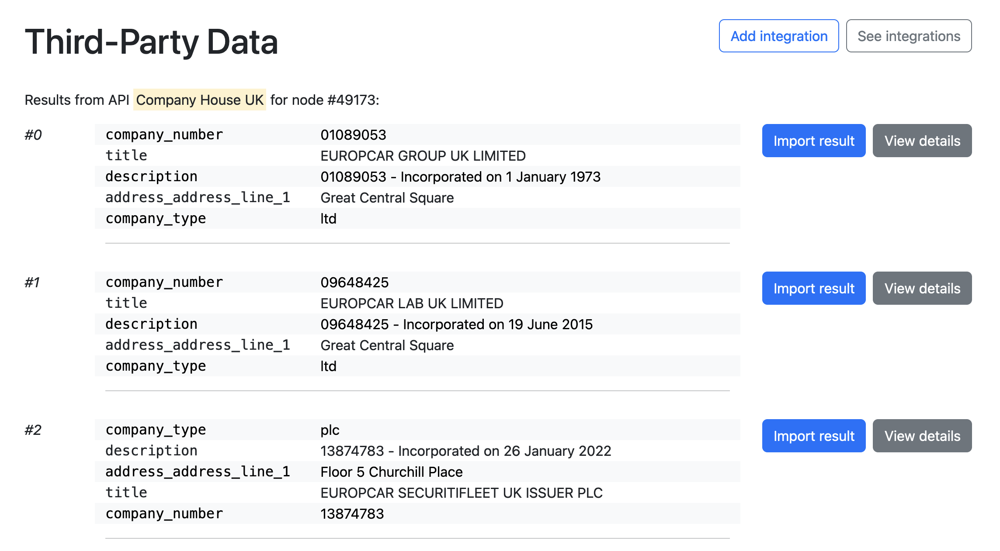

# LKE Plugin: Third-Party Data

## Purpose and principles
The plugin is used to import Third-Party Data to enrich some nodes in your graph:
- For example, you may have a `Company` node in your graph, and you want to enrich it with data from the [French Official Company Information API](https://annuaire-entreprises.data.gouv.fr/).
- You click any `Company` node in the graph, use the `custom action` menu and click `Fetch details for French Company`.
- The plugin opens and shows a list of matching results from the French Company Information API.
- You select the result you want to import, which creates a new `Person_Details` node in the graph with the data from the API, linked to the original `Person` node.

The plugin supports multiple vendor APIs.
To use one API, you must first create an **API integration** (can only be done by an admin).
Then, you can use the plugin to search for matching data for a given node, and create a new node in the graph with the data from the API.

An **API integration** is a configuration that contains:
- the API to use (e.g. `annuaire-entreprises-data-gouv-fr`)
- the data-source to use (e.g. `My transaction graph`)
- the type of node to use as input for searching (e.g. `Company`)
- the properties of the input node to use as search parameters (e.g. `name`, `date_created`)
- the type of node to create as output with the response data (e.g. `Company_Details`)
- the properties of the response to use as properties of the new node (e.g. `email`, `phone`, `company`, `location`, `industry`, `linkedin`, `employee_count`, `revenue`)

## Supported APIs
- [Annuaire des Entreprises (data.gouv.fr)](https://annuaire-entreprises.data.gouv.fr/)
- [Company House (gov.uk)](https://find-and-update.company-information.service.gov.uk/)

## Tutorials & examples
How to get details for a node, from Linkurious Enterprise:

https://github.com/Linkurious/documentation-resources/raw/GEN-927-adding-plugin-doc/Plugins/Third-Party%20Data%20Plugin/assets/d050f4a6-50ca-4961-9aeb-1795a474b425.mov

How to create a new integration:

https://github.com/Linkurious/documentation-resources/raw/GEN-927-adding-plugin-doc/Plugins/Third-Party%20Data%20Plugin/assets/29fffcc0-16d5-4699-bc3e-7e3a8660363e.mov

Screenshot of the main search interface:

## Using the plugin
Installing & accessing:
- Check the documentation on [how to install plugins](https://doc.linkurious.com/admin-manual/latest/plugins/#how-do-i-install-plugins-).
- Once the plugin is installed, open the plugin page (default path: `/plugins/third-party-data/`).

Features:
- Admin: create/list/edit/delete API integrations
- User: search for matching data for a given input node using an existing API integration
- User: choose a result from the list of matching data to create a new node in the graph